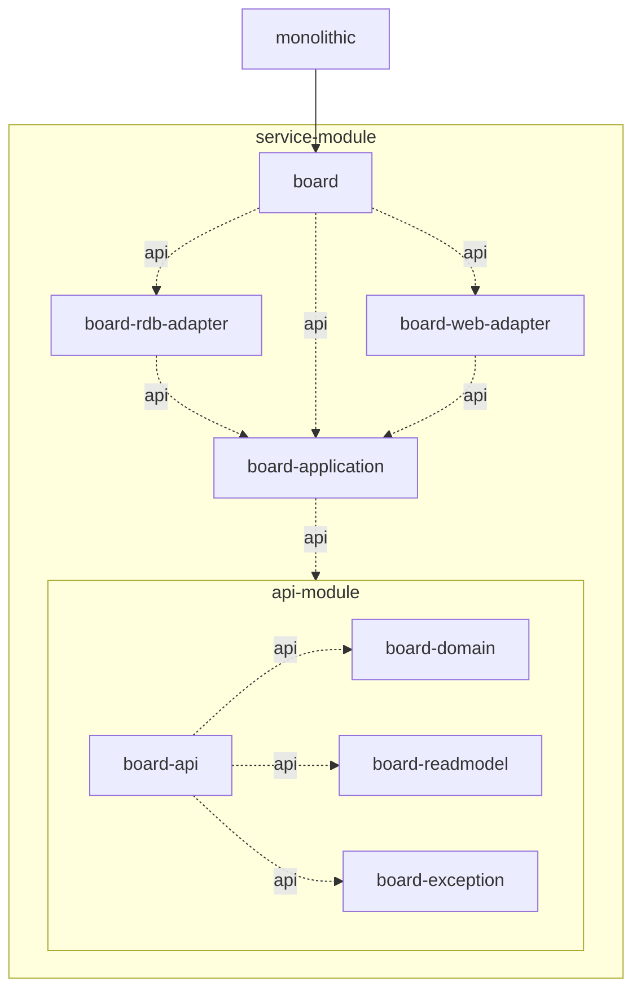

- [프로젝트 환경 구축](#installation)
- [모놀리스 지향 멀티모듈 프로젝트](#ko-monolith)
- [서비스 통합 및 독립의 유연한 전환을 위한 리소스 관리 전략](#ko-resources)
- [각 모듈의 역할](#ko-module-role)
- [추가적인 작업 설명](#additional-works)

<br />

<table border="3">
<tr>
  <td width="45">💡</td>
  <td>

  이 레포지터리는 [Nettee](https://github.com/nettee-space) 멤버들이 멀티모듈 프로젝트 구조를 각자의 관점으로 연구하는 일환으로 작성되었습니다.
  따라서 팀 내에서 논의할 항목이 아니면 일부 설명이 제외되며,
  [헥사고날 아키텍처 온보딩 프로젝트](https://github.com/nettee-space/backend-sample-hexagonal-simple-crud)에서
  이미 다룬 내용에 대한 설명이 대부분 제외되었습니다.

  </td>
</tr>
</table>

<a id="installation"></a>

# 프로젝트 환경 구축

**스크립트 권한 부여** (Mac, Linux)

```shell
chmod +x compose-monolith
```

**모놀리스용 도커 컴포즈 환경 구축** (Mac, Linux, Win*)

윈도우 환경에서는 테스트가 필요합니다.

```shell
./compose-monolith up -d
```

# Demo Multi-Module Project

이 프로젝트는 멀티모듈 프로젝트의 예시입니다.
멀티모듈 구조 설명 외 정보량을 최소화하고 구현을 간소화합니다.

<a id="ko-monolith"></a>

## 모놀리스 지향 구조

- `api`: 모듈 전이는 점선과 `api` label로 표현
- `implementation`: 실선으로 표현



<a id="ko-resources"></a>

## Resources 관리 전략에 대한 고찰

서비스 통합 및 독립의 유연한 전환을 위한 리소스 관리 전략에 대한 고찰입니다.

### AS-IS: 동일한 폴더 및 파일 이름을 사용하되 모듈을 취사선택하는 전략

> MSA 전제의 멀티모듈 프로젝트에서는 RDB Adapter 모듈 대신 Mongo Adapter 모듈 등으로 교체하면 각 모듈의 resources 인식도 전환되었습니다.

기존에는 리소스 폴더에 모듈 이름을 다시 명시하는 번거롭기만 한 깊이를 추가하지 않았습니다.
이제 Monolith 호환을 고려할 때, 다음과 같은 문제가 발생합니다.

- Board RDB Adapter에도 `app/db/db-properties.yml` 파일이 존재합니다.
- Product RDB Adapter에도 `app/db/db-properties.yml` 파일이 존재합니다.

두 파일은 인식 방식이 동일하며, 둘 사이에 우선순위도 없고, 사실 모놀리스에서 사용할 속성조차 아닙니다.
그런가 하면 MSA 전환 시 사용해야 할 속성이기도 합니다.

우리는 MSA 전환에 공수를 줄일 수 있는 모듈러 모놀리스 구조를 리서치하려고 하며 리소스 관리에서는 다음 전략 중 고안해 보고 있습니다.

### TO-BE: 리소스 파일 진짜로 취사선택 하기

#### 모듈별 베이스 폴더로 구분하기

자세한 설명을 예시로 대신합니다.

- `main/db/db-properties.yml` in monolithic main runner module.
- `board/db/db-properties.yml` in board rdb adapter module or board mongo adapter module, etc.
- `product/db/db-properties.yml` in product driven adapter modules.
- `{module-base-folder-name}/db/db-properties.yml` in driven adapter modules.

### 프로퍼티 파일 중앙화

좋은 선택지 중 하나입니다. 단, MSA 전환에 많은 공수를 요구하고, 서비스 구분과 통합을 취사선택 할 때마다 부담이 발생합니다.

### ✅ 파일 이름에 네임스페이스 붙이기

동일한 폴더 구조를 사용하되, 파일 이름에 모듈별 베이스 접두사를 사용합니다.

- `properties/db/main.database.yml` in monolithic main runner module.
- `properties/db/board.database.yml` in board driven adapter modules.
- `properties/db/product.database.yml` in product driven adapter modules.
- `properties/db/{namespace}.database.yml` in driven adapter modules or monolithic runner module.

<a id="ko-module-role"></a>

## 모듈별 역할

<table border="3">
  <tr height="45">
    <td width="45">🚀</td>
    <td>Coming Soon</td>
  </tr>
</table>

### 공통 모듈

모든 모듈에 공통으로 사용할 수 있도록 보장할 것들을 작성합니다.
공통 모듈의 구현 스타일은 팀에 따라 양극화되는데, 과도하게 무겁게 구현하거나 매우 가볍게 구현합니다.
이 예시는 매우 가벼운 구현을 지향합니다.

- 종속성 허용 범위: 스프링 및 롬복 등 팀 내에서 반드시 허용하기로 정한 것들
- 종속성 제외 예시
  - Spring WebMVC에서만 사용 가능한 기능 (ex: 당장 WebFlux 사용 계획이 없더라도, 추후에 단지 종속성 충돌 때문에 사용할 수 없는 구조면 안 됨.)
  - Spring Data JPA나 Datasource가 반드시 필요한 기능 (ex: Flyway 등)
  - 기타 반드시 사용한다고 보장하지 않는 종속성

### 코어 모듈 및 API 모듈

<table>
<tr>
  <td width="500">

  <p>Core Module and API Module</p>

  ```mermaid
  flowchart LR
    example-core -. includes .-> example-api
  ```

  </td>
</tr>
</table>

- **코어 모듈은 응집도 있게 만든 <ins>기능적인 공통 모듈</ins> 역할을 합니다.**
  예를 들어, JPA 커스텀 코어 모듈을 만들어 여러 서비스에 공통된 설정을 포함할 수 있습니다.
- **API 모듈은 더욱 기저가 되는 모듈로,** 데이터 타입이나 인터페이스만 포함하는 API 모듈도 흔하게 있습니다.

Core 모듈은 이 API 모듈을 사용해서 특정 기능을 구현하거나 특정 제약을 추가할 수 있습니다.
또한 그 코어 모듈을 사용해 특정 외부 종속성과 함께 사용하는 Impl 모듈을 만들기도 합니다. (impl 네이밍은 고전적 관례이므로, 이로부터 벗어나곤 합니다.) 

### Board 모듈 구조

헥사고날 아키텍처 (순환참조를 피하면서 코드 중복을 최소화하고 모듈 단위 개발이 원활하게 가능)

- API 모듈: 도메인 모듈, 조회 모델 모듈, 예외 및 에러코드 모듈 등 기저가 되는 요소를 제공합니다.
  - Domain 모듈
  - 조회모델(Read Model) 모듈
  - 예외(Exception) 모듈
- Application 모듈: 포트(repository, use-case) 및 서비스 레이어를 제공합니다.
- RDB Adapter 모듈: Repository 포트를 구현한 어댑터를 제공합니다.
- Web Adapter 모듈: 쉽게 말해 컨트롤러와 DTO 등을 제공합니다.

<a id="additional-works"></a>

## 추가적인 작업

### Board Entity Status 코드 값의 각 비트가 의미를 갖습니다.

다음 내용을 담아 Semantic code를 사용합니다.
이는 데이터베이스 등 인프라스트럭처에 종속되는 Driven Adapter 특성을 고려해, 데이터베이스 변경 시 바뀔 수 있는 값입니다.

- 4바이트 정수를 사용합니다. (PostgreSQL INTEGER)
- R CCC CCCC CCCC CCCC C DDD DDDD DDDD DDDD
  - R: General Purpose Readable
    - 1: Readable, 0: Unreadable
  - C: Classifying Bits (16 bits)
  - D: Detailed or Padded Bits (15 bits)
- 각 상태가 갖는 코드 값은 고유해야 합니다.

