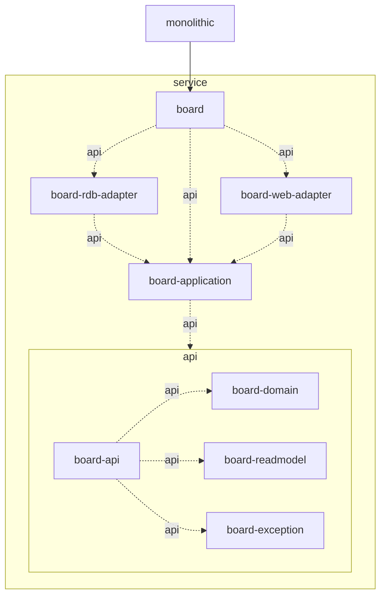

<table border="3">
  <tr>
    <td>🏗</td>
    <td>Coming soon . . .</td>
  </tr>
</table>

# Demo Multi-Module Project

이 예시는 구조 설명 외 정보량을 최소화합니다. (구현 간소화)

- `api`: 모듈 전이는 점선과 `api` label로 표현
- `implementation`: 실선으로 표현

